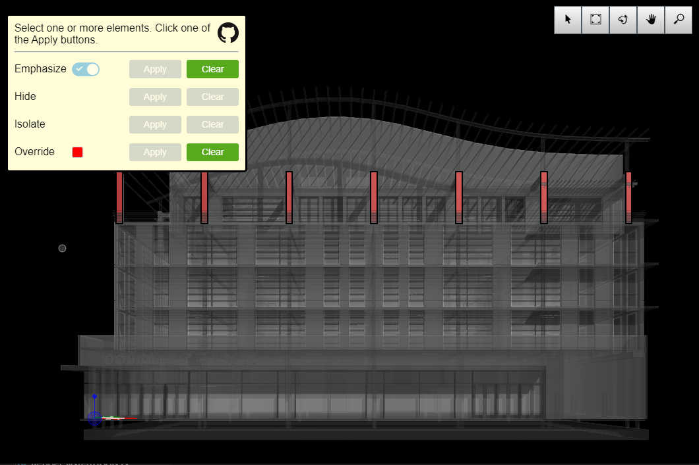

# Emphasize Elements Sample

Copyright © Bentley Systems, Incorporated. All rights reserved.

An iModel.js sample application that demonstrates how to use the EmphasizeElements API.  The API allows for elements to be hidden, emphasized, and colorized.

This is a 'frontend-only' sample.  It utilizes frontend-sample-base which supplies the viewport and view navigation tools. See http://imodeljs.org for comprehensive documentation on the iModel.js API and the various constructs used in this sample.

## Purpose

The purpose of this application is to demonstrate the following:

- Emphasize - call attention to specific elements while fading the rest to the background.
- Hide - prevent display of specific elements.
- Isolate - display only specific elements while hiding the rest.
- Override - change the color of specific elements.

## Development Setup

Follow the instructions under [Frontend Sample Development Setup](../../README.md#frontend-sample-development-setup) to configure, install dependencies, build, and run the app.

## Description

The EmphasizeElements class is a wrapper that provides an easy-to-call interface to allow common element appearance overrides.  The four treatments (Emphasize, Hide, Isolate, and Override) cover the most common requirements while lower level APIs allow for more direct control.

This sample works in concert with the SelectElement tool to allow the user to apply each of the four treatments to elements of the user's choosing.  Simply select one or more elements and click one of the four apply buttons.  This triggers a call to one of the following methods:
  EmphasizeElements.emphasizeSelectedElements
  EmphasizeElements.hideSelectedElements
  EmphasizeElements.isolateSelectedElements
  EmphasizeElements.overrideSelectedElements

## Contributing

[Contributing to iModel.js](https://github.com/imodeljs/imodeljs/blob/master/CONTRIBUTING.md)
