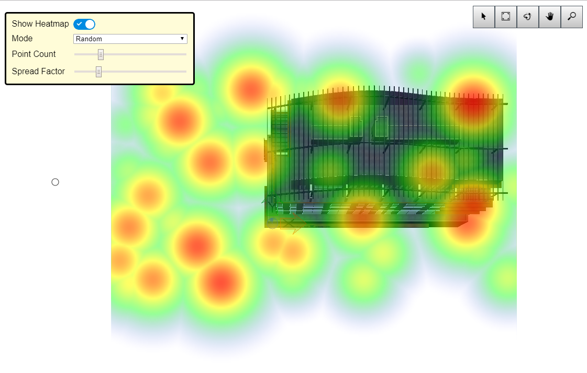

# Heatmap Decorator Sample

Copyright © Bentley Systems, Incorporated. All rights reserved.

An iModel.js sample application that demonstrates how to create custom decorator graphics.  Those graphics are used as an overlay to embellish the default iModel based graphics.

This is a 'frontend-only' sample.  It utilizes frontend-sample-base which supplies the viewport and view navigation tools. See http://imodeljs.org for comprehensive documentation on the iModel.js API and the various constructs used in this sample.

## Purpose

The purpose of this application is to demonstrate the following:

* Adding a custom [Decorator](./src/Sample.tsx) to the render pipeline.
* Building a custom [Render Graphic](./src/HeatmapDecorator.tsx) and managing its lifecycle.

## Development Setup

Follow the instructions under [Frontend Sample Development Setup](../../README.md#frontend-sample-development-setup) to configure, install dependencies, build, and run the app.

## Description

Once registered, a Decorator is called once every render frame and given an opportunity to add RenderGraphics to the scene being displayed by a Viewport.  For this sample, the HeatmapDecorator class provides a simple API to control the Heatmap image using a set of points, a range, and a spread factor.  With these inputs the HeatmapDecorator builds an image, a texture mapping, and a material.  The material is mapped to a simple shape which is then used to build a RenderGraphic for display.  For each point, the graphic contains a splotch of color constructed from a custom color gradient.  The color gradient is partially transparent so that the underlying iModel geometry can be viewed under the heatmap.

The sample generates the input points according to three patterns: Random, Circle, and Cross.  The size of the point pattern is controlled by the geometric extents of the iModel.  These patterns are entirely artificial.  In a working implementation the points would be determined by querying either the iModel or some other data source.  The sample also includes a basic user interface for driving the inputs.  This allows you to control the pattern of the points, the number of points, and the spread of the color splotches.

For the purposes of the sample, the heatmap decoration is always a square oriented in the XY plane at a height set by the maximum height of the iModel's geometry.

## Contributing

[Contributing to iModel.js](https://github.com/imodeljs/imodeljs/blob/master/CONTRIBUTING.md)
