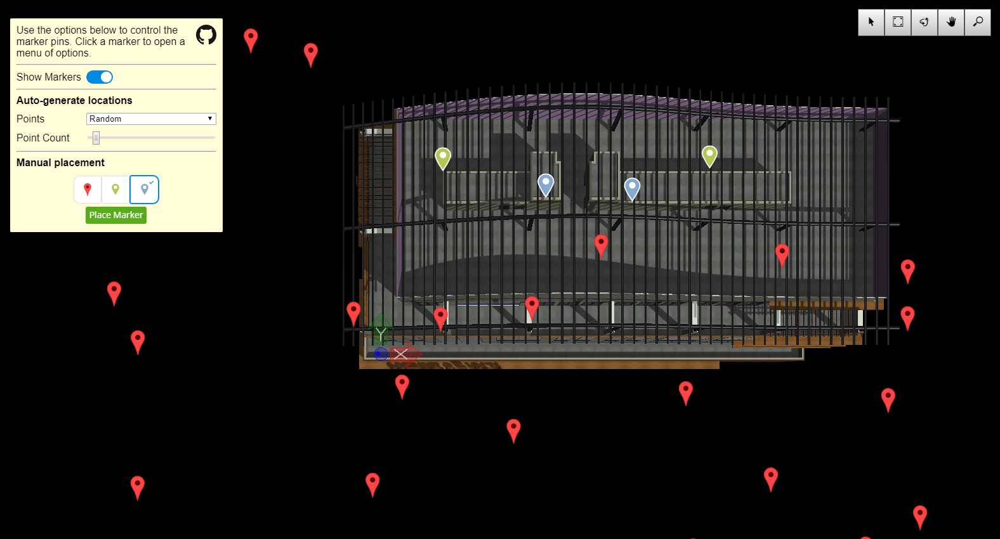

# Marker Pin Sample

Copyright © Bentley Systems, Incorporated. All rights reserved.

An iModel.js sample application that demonstrates how to create a [Decorator](https://www.imodeljs.org/learning/frontend/viewdecorations/) that draws [Markers](https://www.imodeljs.org/learning/frontend/markers/). This technique is useful to visually indicate or call
attention to a point of interest in world space.

This is a 'frontend-only' sample.  It utilizes frontend-sample-base which supplies the viewport and view navigation tools. See http://imodeljs.org for comprehensive documentation on the iModel.js API and the various constructs used in this sample.

## Purpose

The purpose of this application is to demonstrate the following:

- Creating a [Decorator](https://www.imodeljs.org/reference/imodeljs-frontend/views/decorator/) which shows application generated graphics in a viewport.
- Implementing a [MarkerSet](https://www.imodeljs.org/reference/imodeljs-frontend/views/markerset/) to manage a collection of points-of-interest.
- Implementing [Marker](https://www.imodeljs.org/reference/imodeljs-frontend/views/marker/) and [Cluster](https://www.imodeljs.org/reference/imodeljs-frontend/views/cluster/) to draw graphics at the points-of-interest.
- Implementing a [PrimitiveTool](https://www.imodeljs.org/reference/imodeljs-frontend/tools/primitivetool/) to collect user input and add new markers to the viewport.

## Development Setup

Follow the instructions under [Frontend Sample Development Setup](../../README.md#frontend-sample-development-setup) to configure, install dependencies, build, and run the app.

## Description

[Markers](https://www.imodeljs.org/learning/frontend/markers/) are a common technique to draw a user's attention to a particular spatial location within a digital twin.  Markers are typically organized into [marker sets](https://www.imodeljs.org/reference/imodeljs-frontend/views/markerset/) and displayed by a [decorator](https://www.imodeljs.org/reference/imodeljs-frontend/views/decorator/).

This sample illustrates two ways to construct a MarkerSet.  The first way uses a collection of points.  For the sample, the points are generated programmically (random, circle, etc.) but in a real application those points would come from a database or other repository of information.  The second way allows the user to manually enter the marker locations.  To enable this, the sample implements a very simple [PrimitiveTool](https://www.imodeljs.org/reference/imodeljs-frontend/tools/primitivetool/) to collect the user's mouse clicks.

This sample also illustrates a way that users can interact with a Marker.  By implementing [Marker.onMouseButton ](https://www.imodeljs.org/reference/imodeljs-frontend/views/marker/#onmousebutton), the sample will pop up a small menu when the user clicks on a marker.  Some simple actions are included in the popup menu to serve as examples.

## Contributing

[Contributing to iModel.js](https://github.com/imodeljs/imodeljs/blob/master/CONTRIBUTING.md)
