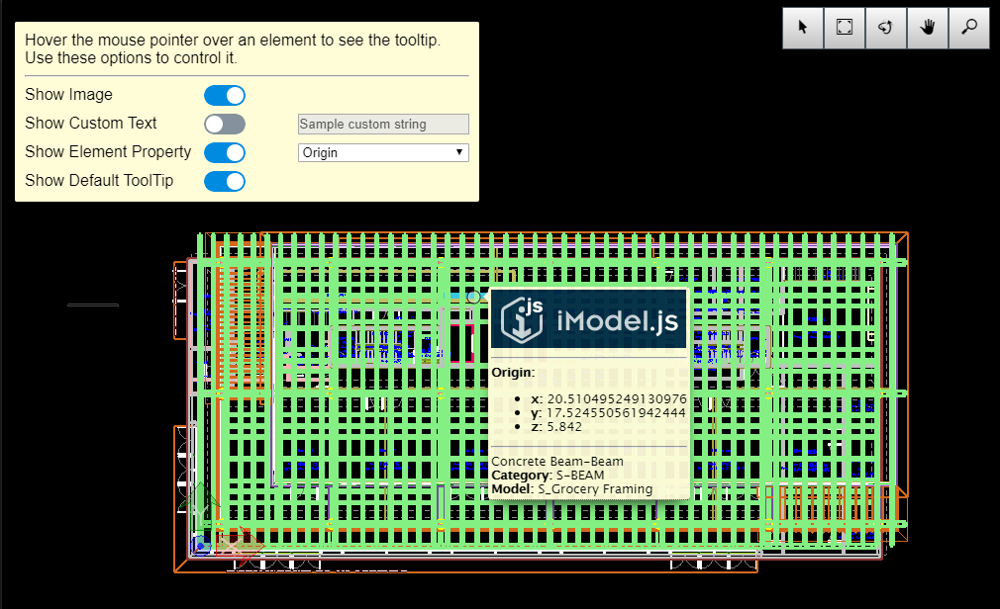

# Tooltip Customize Sample

Copyright © Bentley Systems, Incorporated. All rights reserved.

An iModel.js sample application that demonstrates how to customize the element tooltip.  The customized tooltip is shown when the user hovers the mouse pointer over a spatial element within the iModel.js viewport.

This is a 'frontend-only' sample.  It utilizes frontend-sample-base which supplies the viewport and view navigation tools. See http://imodeljs.org for comprehensive documentation on the iModel.js API and the various constructs used in this sample.

## Purpose

The purpose of this application is to demonstrate the following:

* Specify the content of a tooltip by [implementing ToolAdmin.getToolTip](./src/sample.tsx). 
* Display a tooltip by [implementing NotificationManager](../../tools/frontend-sample-base/src/Notifications/NotificationManager.tsx).

## Development Setup

Follow the instructions under [Frontend Sample Development Setup](../../README.md#frontend-sample-development-setup) to configure, install dependencies, build, and run the app.

## Description

Requests to display tooltips originate in the imodeljs-frontend package whenever the mouse pointer hovers over an element or decoration.  The imodeljs-frontend package forwards that event to the method ToolAdmin.getToolTip.  By default, ToolAdmin forwards the request to the active tool.  In this sample, we create a subclass of ToolAdmin and override ToolAdmin.getTooltip and take over the process of generating the tooltip contents.  The sample code produces an HTMLElement which it returns to the imodeljs-frontend.

The imodeljs-frontend package is written to be independent of any specific user interface framework.  As such, it cannot display the tooltip directly.  Instead it forwards the HTMLElement for the tooltip to NotificationManager.showToolTip.  See [frontend-sample-base](../../tools/frontend-sample-base/readme.md) for more information.

## Contributing

[Contributing to iModel.js](https://github.com/imodeljs/imodeljs/blob/master/CONTRIBUTING.md)
