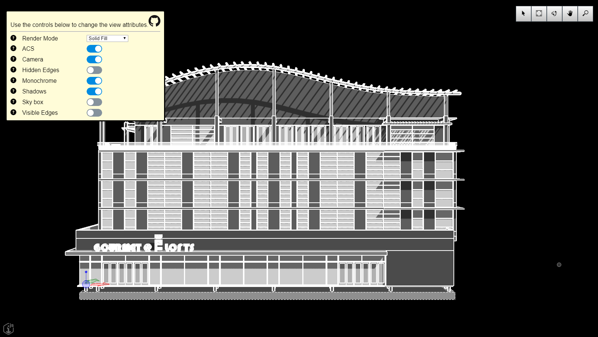

# View Attributes Sample

Copyright © Bentley Systems, Incorporated. All rights reserved.

An iModel.js sample application that demonstrates the API used to control view attributes.

This is a 'frontend-only' sample.  It utilizes frontend-sample-base which supplies the viewport and view navigation tools. See http://imodeljs.org for comprehensive documentation on the iModel.js API and the various constructs used in this sample.

## Purpose

The purpose of this application is to demonstrate the following:

* Modifying view attributes using the Viewport API.
* The effect of those attributes on the display.

## Development Setup

Follow the instructions under [Frontend Sample Development Setup](../../README.md#frontend-sample-development-setup) to configure, install dependencies, build, and run the app.

## Description

This sample demonstrates using the Viewport class to modify view attributes which affect how models are displayed.  The sample provides a user interface to change the render mode, to turn on or off the view camera and skybox, and to toggle the following viewflags:
- ACS
- Hidden Edges
- Monochrome
- Shadows
- Visible Edges

## Contributing

[Contributing to iModel.js](https://github.com/imodeljs/imodeljs/blob/master/CONTRIBUTING.md)
