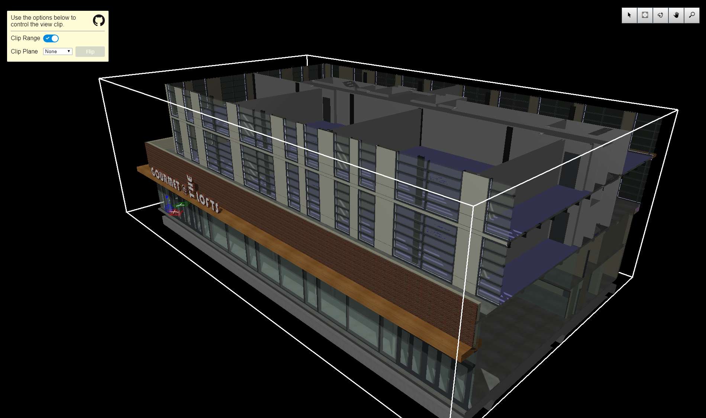

# Clipping Plane Sample

Copyright © Bentley Systems, Incorporated. All rights reserved.

An iModel.js sample application that demonstrates how add a clipping range, clipping plane, and range decorators to a view. 

This is a 'frontend-only' sample.  It utilizes frontend-sample-base which supplies the viewport and view navigation tools. See http://imodeljs.org for comprehensive documentation on the iModel.js API and the various constructs used in this sample.

## Purpose

The purpose of this application is to demonstrate the following:

* Clipping range - Clip the 3D model with a range.
* Clipping plane - Clip the 3D model with a plane.
  * Edit an existing clipping plane. 
* Decorators - Add decorators and handles to adjust the size of the clipping range.

## Development Setup

Follow the instructions under [Frontend Sample Development Setup](../../README.md#frontend-sample-development-setup) to configure, install dependencies, build, and run the app.

## Description

This sample demonstrates how to add a `ClipVector` around the displayed extents of the model. The first step is to get `displayedExtents` from the `ScreenViewport` and creating a `ClipShape` from that range. Next, the `ClipShape` is added to the `ScreenViewport` by using `viewport.view.setViewClip`. Finally, `ViewClipDecorationProvider` is used to add or hide the decorators and handles. The default behavior of hiding decorators on selection is overridden.

A clipping plane can also be addded on the X, Y, or Z axis in the middle of the model. The sample also demonstrates how to edit an existing clip plane, in this case negating or "flipping" the clip.

## Contributing

[Contributing to iModel.js](https://github.com/imodeljs/imodeljs/blob/master/CONTRIBUTING.md)
