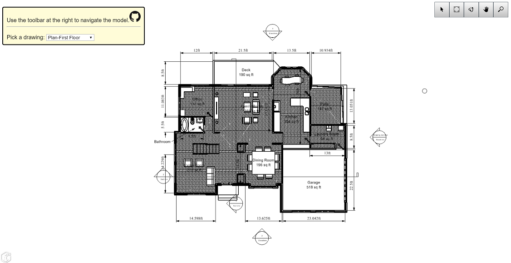

# Viewer Only 2D Sample

Copyright © Bentley Systems, Incorporated. All rights reserved.

An iModel.js sample application that lets you view 2D models.

This is a 'frontend-only' sample. It utilizes frontend-sample-base which supplies the viewport and view navigation tools. See http://imodeljs.org for comprehensive documentation on the iModel.js API and the various constructs used in this sample.

## Purpose

The purpose of this application is to demonstrate the following:

- Present list of 2D models in given iModel.
- If no 2D model found, display appropriate message.
- Switch between various 2D models.
- Create a view for the selected model and update the viewport to show it.

## Development Setup

Follow the instructions under [Frontend Sample Development Setup](../../README.md#frontend-sample-development-setup) to configure, install dependencies, build, and run the app.

## Description

This sample showcases iModel.js 2D viewing capabilities. It obtains a list of 2D models by using the [queryProps](https://www.imodeljs.org/reference/imodeljs-frontend/imodelconnection/imodelconnection.models/queryprops/) API within the [IModelConnection.Models](https://www.imodeljs.org/reference/imodeljs-frontend/imodelconnection/imodelconnection.models/) class. This allows you filter models based on certain query parameters. In this case, it filters out the 2D models which are then presented in a list. When the user selects a [model](https://www.imodeljs.org/reference/imodeljs-backend/models/model/?term=model), it creates a default [view](https://www.imodeljs.org/learning/frontend/views/) for it and calls for the [Viewport](https://www.imodeljs.org/reference/imodeljs-frontend/views/viewport/?term=viewport) to display it. It also centers the view such that then entire contents of the model fit inside the Viewport. 

## Contributing

[Contributing to iModel.js](https://github.com/imodeljs/imodeljs/blob/master/CONTRIBUTING.md)
