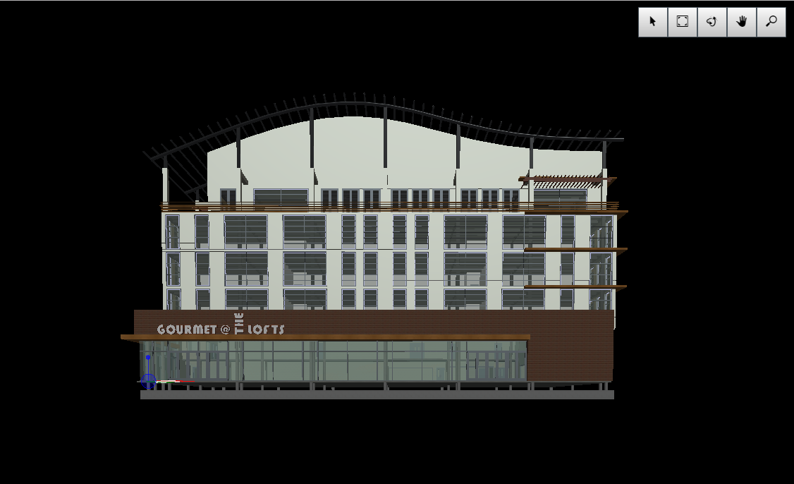

# Viewer Only Sample

Copyright © 2019 Bentley Systems, Incorporated. All rights reserved.

An iModel.js sample application that only displays a viewport and a navigation toolbar.

This is a 'frontend-only' sample.  It utilizes frontend-sample-base which supplies the viewport and view navigation tools. See http://imodeljs.org for comprehensive documentation on the iModel.js API and the various constructs used in this sample.

## Purpose

The purpose of this application is to demonstrate the following:

* User sign-in and open iModel with the logic delivered with frontend-sample-base.
* Display a viewport with navigation toolbar.

## Development Setup

Follow the instructions under [Frontend Sample Development Setup](../../README.md#frontend-sample-development-setup) to configure, install dependencies, build, and run the app.

## Description

This sample is the most basic stub possible based on frontend-sample-base.  It can be used as a template for creating new frontend-samples.

## Contributing

[Contributing to iModel.js](https://github.com/imodeljs/imodeljs/blob/master/CONTRIBUTING.md)
