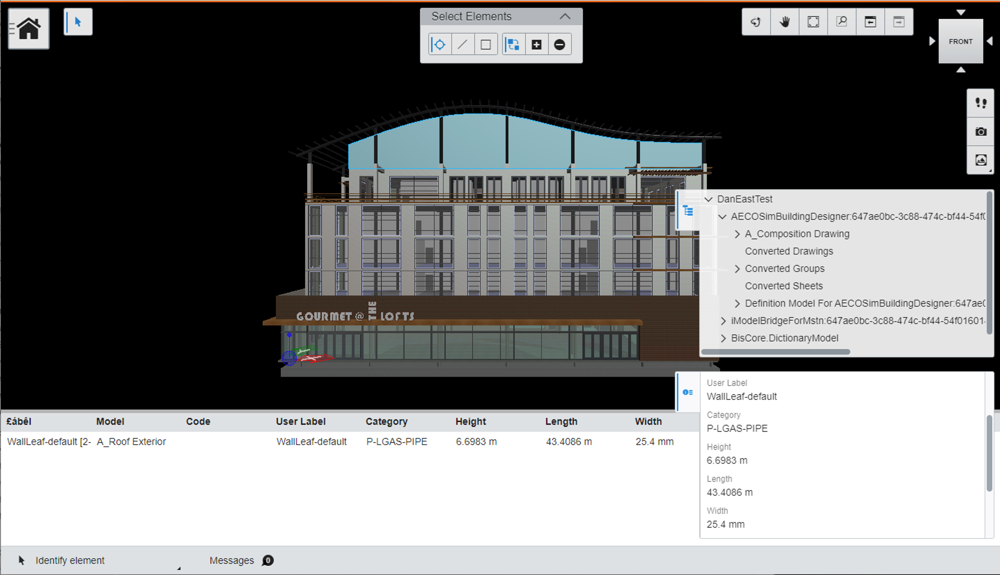
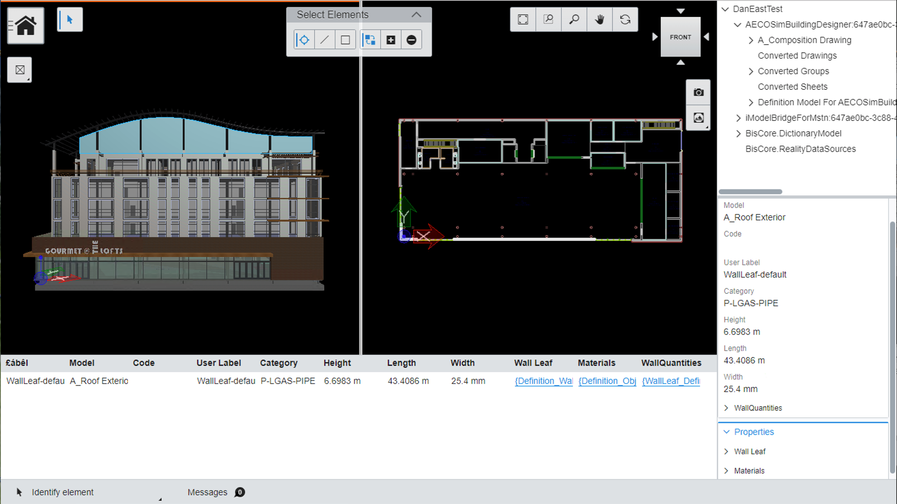

# 9-Zone Sample App

Copyright © Bentley Systems, Inc. 2019

This iModel.js sample application uses the Bentley 9-Zone UI layout pattern and demonstrates opening an iModel and viewing its data. 
For an overview of the 9-Zone UI layout pattern, see [9-Zone UI Pattern](https://imodeljs.github.io/iModelJs-docs-output//learning/ui/ninezone/).

The user interface is structured using nine zones located in the corners and along the edges of the screen.
Each zone contains one or more widgets. The entire screen contains the main content. There may be multiple content views in this area
separated by splitters.

- The zone in the top left contains tool buttons and a Backstage button.
- The zone in the top center contains tool settings.
- The zone in the top right contains navigation buttons and a 3d cube navigation aid.
- The zone in the center right contains the _Tree_ component.
- The zone in the bottom right contains the _Property Grid_ component.
- The zone across the bottom contains a status bar.
- The main content contains two views: the _Viewport_ component rendering geometric data, and the _Table_ component.

The data is presented using the following components:

- _Viewport_: Renders geometric data onto an HTMLCanvasElement.
- _Tree_: Displays a hierarchical view of iModel contents.
- _Property Grid_: Displays properties of selected element(s).
- _Table_: Displays element properties in a tabular format.

There is also a panel on the right edge that is empty initially. The widgets in the center right and bottom right zones can be dragged to this panel by
dragging their tabs. The widgets can also be dragged back to the zones.

A second frontstage may be activated from the backstage (opened by pressing the Home button). This frontstage displays two viewports side-by-side and uses panels to display the 3 data components. The view layout may also be switched to display a single viewport by clicking the button below the Home button.

This app serves as a guide on how you can develop your own 9-zone application.
See http://imodeljs.org for comprehensive documentation on the iModel.js API and the various constructs used in this sample.

## Development setup

Follow the [App Development Setup](../../README.md) section under Sample Interactive Apps to configure, install dependencies, build, and run the app.

## Purpose

The purpose of this application is to demonstrate the following:

- [Dependencies](./package.json) required for iModel.js-based frontend applications.
- [Scripts](./package.json) recommended to build and run iModel.js-based applications.
- How to set up a simple backend for
  [web](./src/backend/web/BackendServer.ts) and
  [electron](./src/backend/electron/main.ts).
- How to set up a simple [frontend for web and electron](./src/frontend/app/NineZoneSampleApp.ts).
- How to implement unified selection between a
  [viewport](./src/frontend/components/Viewport.tsx),
  [tree](./src/frontend/components/Tree.tsx),
  [property grid](./src/frontend/components/Properties.tsx) and a
  [table](./src/frontend/components/Table.tsx).
- How to implement a [Frontstage with multiple Zones and Toolbars](./src/frontend/app-ui/frontstages/SampleFrontstage.tsx),
  Widgets (
  [Property Grid](./src/frontend/app-ui/widgets/PropertyGridWidget.tsx),
  [Tree](./src/frontend/app-ui/widgets/TreeWidget.tsx)
  ), Content views (
  [Table](./src/frontend/app-ui/contentviews/TableContent.tsx),
  Viewport
  ), a [Status Bar](./src/frontend/app-ui/statusbars/AppStatusBar.tsx)
  and a [Backstage](./src/frontend/app-ui/backstage/AppBackstageItemProvider.tsx).
- How to implement a [Frontstage with multiple Viewports](./src/frontend/app-ui/frontstages/SampleFrontstage2.tsx)

For more information about developing a 9-Zone app, see [Learning ui-framework Package](https://imodeljs.github.io/iModelJs-docs-output//learning/ui/framework/).

## Contributing

[Contributing to iModel.js](https://github.com/imodeljs/imodeljs/blob/master/CONTRIBUTING.md)
