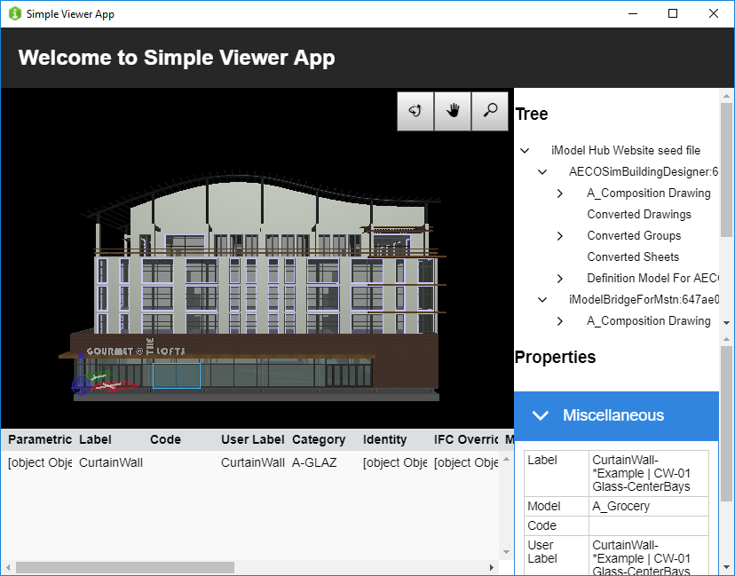

# Simple Viewer App

Copyright © 2019 Bentley Systems, Incorporated. All rights reserved.

An iModel.js sample application that demonstrates opening an iModel and viewing its data. The data is presented using the following components:

* _Viewport_: Renders geometric data onto an HTMLCanvasElement.
* _Tree_: Displays a hierarchical view of iModel contents.
* _Property Grid_: Displays properties of selected element(s).
* _Table_: Displays element properties in a tabular format.

This app serves as a guide on how you can embed one or more of these components into your own application.
See http://imodeljs.org for comprehensive documentation on the iModel.js API and the various constructs used in this sample.

## Development Setup

1. (Optional) Create a sample project using the procedure at [Developer Registration](https://imodeljs.github.io/iModelJs-docs-output/getting-started/#developer-registration).  This step is not needed if you already have a project to test with.

2. (Recommended) Register your application at [Developer Registration](https://imodeljs.github.io/iModelJs-docs-output/getting-started/#developer-registration).

    For the purpose of running this sample on localhost, ensure your registration includes http://localhost:3000/signin-callback as a valid redirect URI.

    Note: If you are just testing on localhost you can use the default registration included in this sample. However, it's recommended that you complete the registration, especially since registration is a requirement before the application can be deployed. For more information, see the section on [authorization](https://imodeljs.github.io/iModelJs-docs-output/learning/common/accesstoken/).

3. Edit [src/common/configuration.ts](./src/common/configuration.ts) and [src/common/config.json](./src/common/config.json) to set the values you obtain from the registration process.

4. Install the dependencies

  ```sh
  npm install
  ```

5. Build the application

  ```sh
  npm run build
  ```

6. There are two servers, a web server that delivers the static web resources (the frontend Javascript, localizable strings, fonts, cursors, etc.), and the backend RPC server that opens the iModel on behalf of the application. Start them both running locally:

  ```sh
  npm run start:servers
  ```

7. Open a web browser (e.g., Chrome or Edge), and browse to localhost:3000.

[//]: # (Commented out until Electron version fixed. Note: The Electron version is meant to run on desktops, but will currently not work within a virtual machine.)



## Testing

Run both e2e and unit tests with `npm test`

### End-to-end tests

You can run just end-to-end tests with `npm run test:e2e`. But it takes a while
to build and start the tests, so if want to actively change something within them,
first launch the app with `npm run test:e2e:start-app` and when it's done `npm run test:e2e:test-app`

If you want to see what tests do behind the scenes, you can launch them in non
headless mode. Edit the file in *./test/end-to-end/setupTests.ts* and add

```js
{ headless: false }
```

to puppeteer launch options. Like this

```ts
before(async () => {
  browser = await Puppeteer.launch({ headless: false });
});
```

### Unit tests

Run with `npm run test:unit`

## Purpose

The purpose of this application is to demonstrate the following:

* [Dependencies](./package.json) required for iModel.js-based frontend applications.
* [Scripts](./package.json) recommended to build and run iModel.js-based applications.
* How to set up a simple backend for
  [web](./src/backend/web/BackendServer.ts) and
  [electron](./src/backend/electron/main.ts).
* How to set up a simple [frontend for web and electron](./src/frontend/api/SimpleViewerApp.ts).
* How to [implement OIDC sign-in](./docs/oidc.md) to get access to iModels on iModelHub.
* How to [consume](./src/frontend/components/App.tsx) iModel.js React components.
* How to implement unified selection between a
  [viewport](./src/frontend/components/Viewport.tsx),
  [tree](./src/frontend/components/Tree.tsx),
  [property grid](./src/frontend/components/Properties.tsx) and a
  [table](./src/frontend/components/Table.tsx).
* How to include
  [tools](./src/frontend/components/Toolbar.tsx) in a
  [viewport](./src/frontend/components/Viewport.tsx).

## Contributing

[Contributing to iModel.js](https://github.com/imodeljs/imodeljs/blob/master/CONTRIBUTING.md)
